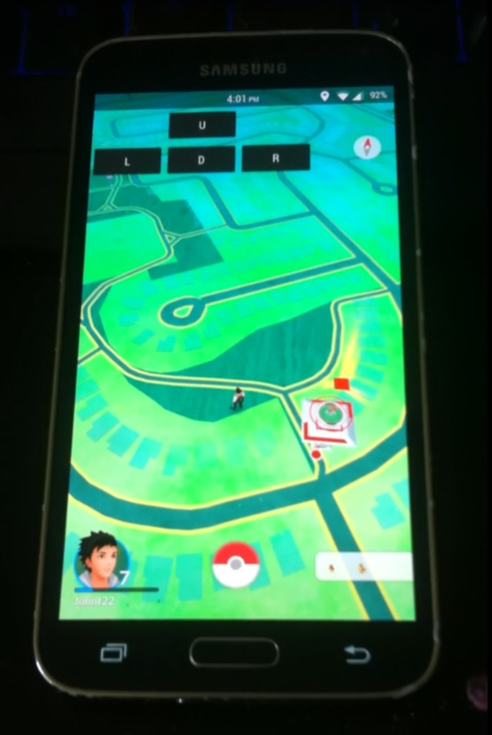
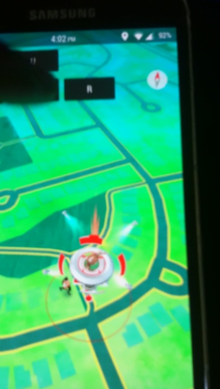
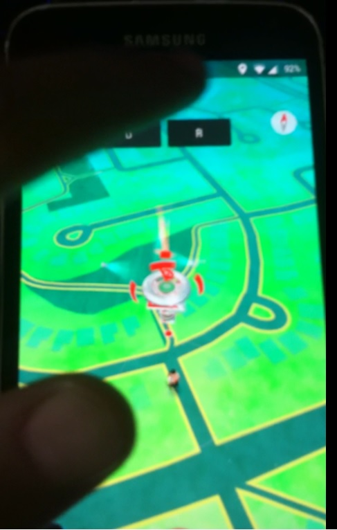

# LazyGo
This APP will spoof and move your GPS coordinates by a little bit, giving the impression of walking. 

# I DO NOT CONDONE THIS
## THEREFORE THE SOURCE CODE IS NOT HERE &/OR PRIVATE!

I created this APP for myself to use because I am LAZY and I do not wish to walk around at night just to catch Pokemon. With the new release of Pokemon GO I needed a way to travel around my area, without actually travelling around my area... YES This is cheating, I do not condone it. But I do like to think its best to work SMART and not HARD. I have nothing against the developers of this game, in fact I wish to support them as much as I can. This is a personal project which can do a lot of damage so I will not release the source code. 

Maybe I'll upload a video soon. 

# Update v2
### New features include 
- Auto walk in circle to hatch eggs
- joystick instead of 4 buttons
- autmatic location finding
- teleport to whatever location you want
- POKEMON API integration!!!! find pokemon near you and display them on the map

### Planned features
- Auto walk to nearest gym
- auto walk to nearest pokemon
- auto walk to set location
- auto pokeball throw
- design overlay
